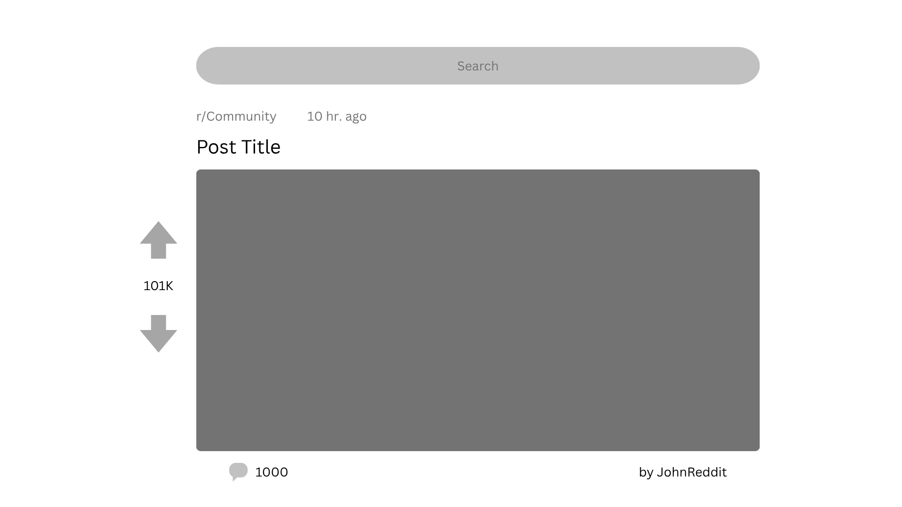

# REGGIT (WIP)
    View and Search posts and comments from Reddit

## Wireframe

## Tasks
| Task Name | Objectives | Completed |
|-----------|------------|-----------|
| Plan | Plan out the project | [x] |
| Create Wireframe | Design a basic example of what "Reggit" will look like | [x] |
| Set Up Files | Prepare the web app with React | [x] |
| Version Control | Transform into a Git repo and push to Github | [x] |
| Build Components | [x] Build the app with fake, local data [ ] Make it work with all screen sizes [ ] Create Unit Tests and End-to-End Tests | [ ] |
| Add Reddit Data | Connect the app to the Reddit API | [ ] |
| Publish | Deploy the app | [ ] |
| Extra | Improve the app | [ ] |

## Technologies
Technologies Used (e.g. React, Redux, etc.)

## Features
Features of the app

## Future Work
### Planned
Future Additional Features

### Concepts
Ideas